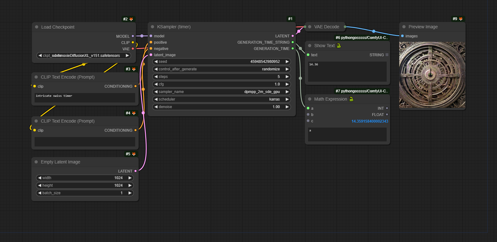
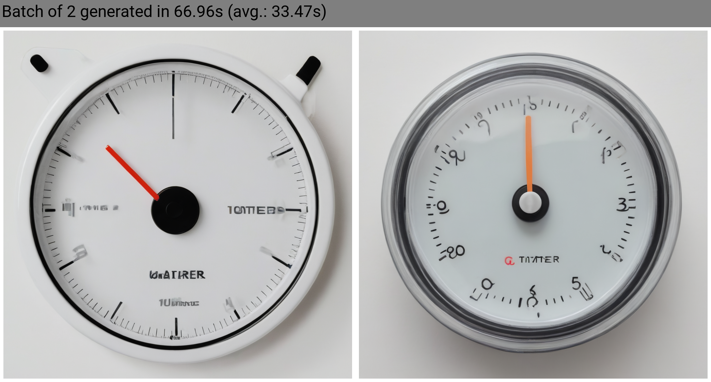

# KSampler (timer)

> by [@IndustrialVectors](https://civitai.com/user/IndustrialVectors)\
> repository [GitLab](https://gitlab.com/lanterieur/comfyui_ksamplertimer)\
> license MIT

A custom node that returns the generation time of the KSampler.

Intended for benchmarking or debugging.

## Install

1. Clone this project into the `custom_nodes` directory of your ComfyUI install directory.\
`git clone https://gitlab.com/lanterieur/comfyui_ksamplertimer.git`

2. (Re)Start ComfyUI

## Usage

- The custom node is called `KSampler (timer)`.
- The node is found under `add node > sampling > KSampler (timer)`.

## Behavior

This node is just a wrapper around the native KSampler. This node adds two outputs to the KSampler:
- GENERATION_TIME_STRING\
  The time in seconds as a float string with 2 numbers after the comma.
- GENERATION_TIME\
  The time in seconds as a float.

## Batches

The time returned is for the whole batch.

You may have to divide the generation time by the batch size to get the average generation time. (See examples on how to do it.)

## Examples

See the sample workflows in the `workflows` sub directory.